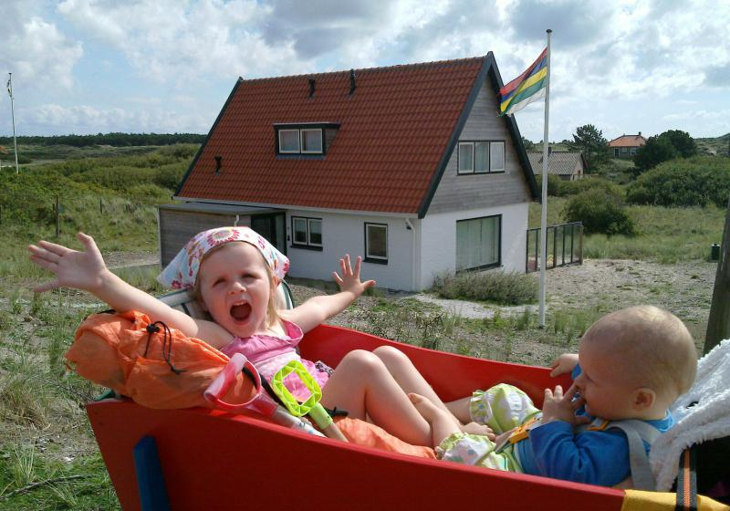

# Vakantiehuis Konijnehol - Terschelling

Dit repository-overzicht beschrijft de officiële website van **Konijnehol**, een vrijstaand vakantiehuis gelegen in de duinen van Midsland aan Zee op het eiland Terschelling. De website dient als informatiebron voor huurders over de faciliteiten, beschikbaarheid en boekingsinformatie.

## Over de Accommodatie
Het Konijnehol is een comfortabel, vrijstaand vakantiehuis met een woonoppervlakte van circa 100 m² op een perceel van 1400 m² eigen duingrond. Het huis biedt een beschutte ligging met een terras op het zuiden en uitzicht over een duinvallei, op loopafstand (circa 600 meter) van het strand.

## Belangrijkste Onderwerpen op de Website
* **Het Huis:** Gedetailleerde indeling (3 slaapkamers, 2 badkamers), voorzieningen zoals centrale verwarming, zonneboiler, wasmachine/droger en een half-open keuken.
* **Huurinformatie:** Informatie over huurperiodes (in het hoogseizoen per week van zaterdag tot zaterdag, daarbuiten minimaal 3 nachten), borgsommen en de verplichte eindschoonmaak.
* **Locatie & Route:** Informatie over hoe het huis te bereiken is per veerboot en bus, inclusief tips voor bagagevervoer en fietsverhuur op het eiland.
* **Bezetting:** Actueel overzicht van de beschikbaarheid van het vakantiehuis.

## Belangrijke Kenmerken
* **Capaciteit:** Geschikt voor maximaal 6 personen.
* **Duurzaamheid:** Voorzien van centrale verwarming en een zonneboiler voor warm water.
* **Huisregels:** In het Konijnehol is roken niet toegestaan en er zijn geen huisdieren toegestaan.
* **Zelfvoorzienend:** Huurders dienen zelf beddengoed, handdoeken en keukendoeken mee te nemen (linnenhuur is optioneel mogelijk).

## Praktische Informatie
* **Website:** [konijnehol.nl](https://konijnehol.nl/)
* **Locatie:** Midsland aan Zee 364, Terschelling.
* **Contact:** Voor boekingen en nadere informatie kan contact worden opgenomen met de verhuurder via e-mail ([benn@wxs.nl](mailto:benn@wxs.nl)).

## Doel van de website
De website is ontworpen om:
1. Potentiële gasten te informeren over de faciliteiten en de unieke ligging in de duinen.
2. Inzicht te geven in de beschikbaarheid en huurvoorwaarden.
3. Een helder beeld te schetsen van de route en de logistieke mogelijkheden op Terschelling.
4. Direct contact met de verhuurders te faciliteren voor reserveringen.

***

*Disclaimer: Dit README-bestand is gegenereerd op basis van de publiek toegankelijke informatie van de website konijnehol.nl.*

# Repository with html files konijnehol.nl

Site ran for 14 years in a Wordpress environment, where nothing actually has been posted for last few years.

Wordpress was a huge overhead for 'just' a simple site. Therefor pages were converted to plain html living hapily on as a lightweight nginx hosted site.

https://konijnehol.nl

